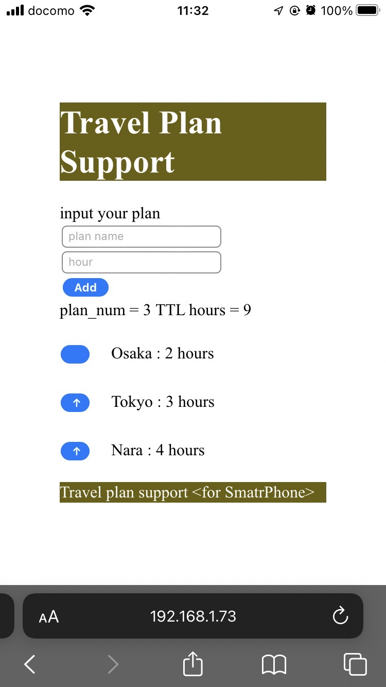

# **旅行計画を補助するアプリ**

## Git repository
https://github.com/9uaresma/TravelPlanSupport

Clone from git

```
#! bash

git clone https://github.com/9uaresma/TravelPlanSupport.git

```


## **デスクトップ版**
---------------------------
### 機能一覧
* 出発時刻と到着時刻を入力してEnterを押すと、時刻表に帯を表示する
* Removeボタンを押すと、帯が消える。


## **ブラウザ版**
---------------------------

### 概要  
ブラウザで動作する機能追加中．  
nodejsからc++のクラスを呼び出す構造

ビューワー: nodejsで作成

処理系: c++ でnodejsのaddon作成

### 使い方
Input your plan の所に，Plan名 と，所要時間を記入して，Addをクリック  
すると，Planと所要時間の一覧が画面に表示される． 

また，左側にある 「↑」をクリックすると，順番を入れ替えることができる  


### ビルド手順

あらかじめ，c++のコンパイラをインストールして，Pathを通しておく．  
このへん  
https://www.mingw-w64.org/downloads/

これもいるかも
```

npm install --global windows-build-tools

```


### Nodejsでc++クラスを利用する方法
参考：
https://qiita.com/Akihiro_Nakayama/items/dc31f9ae9519602f9f50

addon/native_cpp/planContainer.cpp に定義したクラスを，wrapper.cppやaddon.cc を使って
nodejsに引き渡している．
planContainer.cppの関数を増やしたら，他の関数を真似つつwrapperやaddonを編集し，以下を実行．

```
#! bash

cd travelplansupport/webviewer
npm install .

```

gyp info ok と表示されればOK  
ビルドに成功したら，ローカルサーバー起動

```

node .\app.js

```

Server running at http://127.0.0.1:3000 と表示されるので，  
ブラウザを開き，urlを入力すると，見れる.


### スマホでアクセスするには
Windowsの設定を編集する．  
Settings > Network を開き，  
Network profile でPrivateにチェックを入れる．  

その後，同様に，
```

node .\app.js

```
でローカルサーバー起動し，
http://127.0.0.1:3000 にアクセス．



<!--

<<Markdown記法に関する自分用メモ>> 
Readme.md をvscode上で編集
    Ctl + 「K」 -> 「V」で，サイドパレットにプレビュー表示できる

Markdown チートシート
    https://gist.github.com/mignonstyle/083c9e1651d7734f84c99b8cf49d57fa

-->
