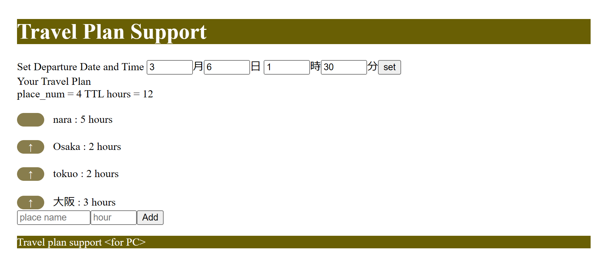

# **旅行計画を補助するアプリ**

## Git repository
https://github.com/9uaresma/TravelPlanSupport


## **デスクトップ版**
---------------------------
### 機能一覧
* 出発時刻と到着時刻を入力してEnterを押すと、時刻表に帯を表示する
* Removeボタンを押すと、帯が消える。


## **ブラウザ版**
---------------------------

### 概要  
ブラウザで動作する機能追加中．  
Branch: WebViewer

nodejsからc++のクラスを呼び出す構造

ビューワー: nodejsで作成

処理系: c++ でnodejsのaddon作成

### 使い方
Input your plan の所に，Plan名 と，所要時間を記入して，Addをクリック  
すると，Planと所要時間の一覧が画面に表示される． 

また，左側にある 「↑」をクリックすると，順番を入れ替えることができる  


### Browser version


### For Smartphone


### Support For Desktop !!


### How To Build

#### Environment Setup
* Install c++    
https://www.mingw-w64.org/downloads/  
Pathも通しておく．

* Install node.js  
https://nodejs.org/en/


* Install npm modules    
```
#!bash

npm install --global windows-build-tools
npm install nativefier -g
```

* Clone TravelPlanSupport from git and checkout webviewer branch.

```
#go to the folder where you clone GitHub projects

git clone https://github.com/9uaresma/TravelPlanSupport.git
cd TravelPlanSupport
git checkout WebViewer
```

* Build desktop app
```
./setup.bat
```

* Build node.js app
```
cd travelplansupport/webviewer
npm install .
```
gyp info ok と表示されればOK  
Error表示されたら，何かが足りない．


### Run node.js server
```
cd travelplansupport
node app.js
```

### Excecute desktop application
エクスプローラーでwebviewer/TravelPlanSupport-win32-64を開く．   
TravelPlanSupport.exe をダブルクリック

### Access from WebBrowser
node.jsサーバーを起動したときに，  
```
Server running at http://***.***.**.**:***/
```
と表示されるので，そのアドレスをurlに入力する

### Access from smartphone
あらかじめ，Windowsの設定を編集する．  
Settings > Network を開き，  
Network profile でPrivateにチェックを入れる． 
これで，PCのブラウザと同様にアクセスできる． 


------------------
### 参考情報
* Nodejsでc++クラスを利用する方法
https://qiita.com/Akihiro_Nakayama/items/dc31f9ae9519602f9f50

addon/native_cpp/planContainer.cpp に定義したクラスを，  
wrapper.cppやaddon.cc を使ってnodejsに引き渡す．
planContainer.cppの関数を増やしたら，他の関数を真似つつwrapperやaddonを編集し，以下を実行すれば，反映される．

```
#! bash

cd travelplansupport/webviewer
npm install .
```

* デスクトップ版  
nativefierを使って生成している．
参考：https://loumo.jp/archives/18435  
なんでもデスクトップアプリにできる！！


<!--

<<Markdown記法に関する自分用メモ>> 
Readme.md をvscode上で編集
    Ctl + 「K」 -> 「V」で，サイドパレットにプレビュー表示できる

Markdown チートシート
    https://gist.github.com/mignonstyle/083c9e1651d7734f84c99b8cf49d57fa

-->
